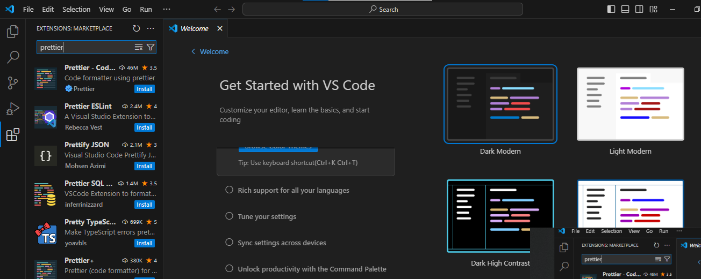

# SE-Assignment-5
Installation and Navigation of Visual Studio Code (VS Code)
 Instructions:
Answer the following questions based on your understanding of the installation and navigation of Visual Studio Code (VS Code). Provide detailed explanations and examples where appropriate.

 Questions:

1. Installation of VS Code:
   - Describe the steps to download and install Visual Studio Code on Windows 11 operating system. Include any prerequisites that might be needed.

<b>ANSWER</b>   
   Prerequisites:
•	Windows 11 operating system
•	Microsoft account (optional, recommended for syncing settings)

<b>Steps:</b>
1.	Download the VS Code installer:
•	Visit the official VS Code download page: https://code.visualstudio.com/download

•	Select the "Windows" tab and click on the "Download for Windows" button.

 

2.	Run the installer:
•	Locate the downloaded installer file and double-click on it.

 

•	Follow the on-screen instructions to complete the installation.

 

3.	Create a Microsoft account (optional):
•	During installation, you will be asked if you want to create or use an existing Microsoft account. Creating an account is recommended for syncing settings across devices. If you prefer not to, you can select "No, thanks" to skip this step.  

4.	Choose installation path:
•	By default, VS Code will be installed in the "C:\Users<username>\AppData\Local\Programs\Microsoft VS Code" directory. You can change this if desired.  

5.	Select additional components:
•	During installation, you will be given the option to install additional components such as Git, Python, and Node.js. Check the boxes for any components you want to include.  
6.	Complete the installation:
•	Click on the "Install" button to start the installation process.
•	Wait for the installation to complete, which may take a few minutes.  

 

7.	Launch VS Code:
•	Once installed, you can launch VS Code by clicking on the "Visual Studio Code" shortcut on your desktop or by searching for it in the Start menu.

Note:
•	If you encounter any errors during installation, make sure that your Windows 11 operating system is up to date and that you have sufficient disk space and permissions.  

2. First-time Setup:
   - After installing VS Code, what initial configurations and settings should be adjusted for an optimal coding environment? Mention any important settings or extensions.

<b>ANSWER</b>

1  Choose a Theme:
•	Select a theme that's easy on the eyes and aligns with your preferences. Consider themes like Dracula, One Dark Pro, or Monokai.

 

2. Adjust Font Size and Style:
•	Change the font size and style to improve readability and reduce eye strain.

3. Enable Auto Save:
•	Ensure auto save is turned on to prevent data loss.

4. Set Code Linting Rules:
•	Configure code linting tools (e.g., ESLint, Prettier) to identify and fix coding style issues.

5. Customize Workspace Settings:
•	Create new workspaces for different projects and adjust settings accordingly (e.g., file exclusion, indentation rules).

Important Settings:

•	Editor: Tab Size: Set the number of spaces used for indentation.

•	Extensions: Auto Import: Enable auto-import suggestions to save time.

•	Terminal: Integrated: Embed a terminal window within VS Code.

•	Tasks: Run Task: Create and execute custom tasks like building or running applications.

<b>Essential Extensions:</b>
•	Code Spell Checker: Checks for spelling errors in code.
•	Debugger for Chrome: Provides debugging capabilities for web applications.
•	Live Share: Collaborate on code with others in real-time.
•	GitLens: Visualizes Git history and provides integration with the source control system.
•	Path Intellisense: Autocompletes file and folder paths.
•	Prettier: Formats code according to a consistent style.
•	Rainbow Brackets: Color-codes matching brackets for easier navigation.
•	Visual Studio IntelliCode: Provides AI-assisted code completions and suggestions.

<b>Additional Tips:</b>
•	Customize Keyboard Shortcuts: Assign keyboard shortcuts to frequently used actions for faster workflow.
•	Use Git Integration: Connect VS Code with Git to manage version control.
•	Explore Extensions Marketplace: Discover and install additional extensions to enhance functionality.
•	Optimize Performance: Install the "Disable Auto Start Extensions" extension to reduce startup time.
  

3. User Interface Overview:
   - Explain the main components of the VS Code user interface. Identify and describe the purpose of the Activity Bar, Side Bar, Editor Group, and Status Bar.

 
   <B>ANSWER</B> 
    

   User Interface Overview
Visual Studio Code (VS Code) is a popular code editor that provides a comprehensive user interface for software development. The main components of the VS Code user interface include:
1.	<b>Activity Bar:</b> 

 

•	Located on the left side of the workspace.
•	Provides quick access to common tasks and features, such as:
•	File Explorer
•	Output window
•	Debug tools
•	Terminal  
2.	<b>Side Bar:</b> 

 

•	Located in the center of the workspace.
•	Contains various sections, including:
•	Explorer: Displays the file and folder structure of the project.
•	Search: Allows users to search for files, symbols, and text within the project.
•	SCM: Provides version control integration, such as Git or Subversion.
•	Extensions: Shows installed extensions and their features.

3.	<B>Editor Group:</B> 

 

•	Takes up the majority of the workspace area.
•	Contains tabs for each open file or editor instance.
•	Provides a dedicated space for editing, viewing, and modifying code. 
4. <b>Status Bar:</b> 

 
•	Located at the bottom of the workspace.
•	Displays information about the current file, such as:
•	Line and column number
•	Encoding
•	Workspace settings
•	Build status (if applicable) 
<b>Purpose of Each Component:</b> 
•	<b>Activity Bar:</b> Enables quick navigation and access to essential tools. 
•	<b>Side Bar:</b> Provides context-specific information, such as file tree, search results, and version control status. 
•	<b>Editor Group:</b> Facilitates efficient code editing and manipulation. 
•	<b>Status Bar:</b> Shows critical information about the file and workspace, allowing developers to monitor progress and make adjustments.  

4. Command Palette:
   - What is the Command Palette in VS Code, and how can it be accessed? Provide examples of common tasks that can be performed using the Command Palette.  

<b>ANSWER</b> 
The Command Palette in Visual Studio Code (VS Code) is a powerful tool that allows users to quickly search for and execute commands within the editor. It provides a centralized interface for accessing a vast range of features and settings. 
<b>How to Access the Command Palette:</b> 
•	Windows/Linux: Ctrl + Shift + P
•	macOS: Cmd + Shift + P

<b>Examples of Common Tasks Performed Using the Command Palette:</b>
•	Open a specific file:
<b>Open File</b> 
•	Create a new file:
<b>New File</b> 
•	Find a symbol:
<b>Find Symbol</b> 
•	Run a specific command:
<b>Run Command</b> 
•	Change the active language mode:
<b>Set Language Mode</b> 
•	Install an extension:
<b>Extensions: Install Extension</b> 
•	Configure user settings:
<b>Preferences: Open Settings</b> 
•	Debug a program:
<b>Debug: Start Debugging</b> 
•	Refactor code:
<b>Refactor</b> 
•	Preview Markdown files:
<b>Markdown: Preview</b> 
•	Toggle word wrap:
<b>View: Toggle Word Wrap</b> 
•	Show/hide the sidebar:
<b>View: Toggle Sidebar</b> 
•	Open Command Palette settings:
<b>Preferences: Open Command Palette (Settings)</b> 
<b>Additional Tips:</b>
•	Commands can be filtered by typing specific keywords or phrases.
•	The Command Palette can also be used to execute custom commands defined by extensions.
•	For frequently used commands, you can create keyboard shortcuts to access them even faster.
•	To view a list of all available commands, type List Commands
in the Command Palette.  

5.<b> Extensions in VS Code:
   - Discuss the role of extensions in VS Code. How can users find, install, and manage extensions? Provide examples of essential extensions for web development.</b>  
<b>ANSWER:</b> 

Visual Studio Code (VS Code) is a popular code editor that provides a wide range of functionality for software development. One of the key features of VS Code is its extensibility through extensions. Extensions allow users to customize and enhance VS Code with additional features, themes, and language support. 
<b>Extensions play a crucial role in VS Code by:</b>
•	Improving productivity: Providing tools and features that automate tasks, streamline workflows, and make coding more efficient.

•	Enhancing functionality: Adding support for new programming languages, frameworks, and technologies, expanding the capabilities of VS Code.

•	Customizing the user interface: Personalizing the code editor with custom themes, keybindings, and layouts.

•	Integrating with external tools: Facilitating seamless integration with other software and services, such as version control systems, debuggers, and testing frameworks.

<b>Finding, Installing, and Managing Extensions:</b>
Users can find extensions in the VS Code Marketplace, an online repository that hosts a vast collection of extensions. To install an extension:
1.	Open the Command Palette (Ctrl/Cmd + Shift + P).
2.	Type "install extension" and select "Install Extension."
3.	Search for the desired extension and click "Install."

Extensions can be managed through the Extensions view, accessible from the Activity Bar on the left-hand side of the VS Code window. In the Extensions view, users can:
•	Enable or disable extensions.
•	Update extensions.
•	Uninstall extensions.
•	View extension details and settings.

<b>Essential Extensions for Web Development</b>
Here are some essential extensions for web development in VS Code:

<b>HTML/CSS Enhancements:</b>
•	<b>Live Server:</b> Enables live preview of HTML and CSS changes in the browser.
•	<b>Auto Rename Tag:</b> Automatically updates closing tags when renaming opening tags.
•	<b>HTML Snippets:</b> Provides a collection of useful HTML snippets for quick code generation.

<b>JavaScript Support:</b>
•	<b>ESLint:</b> Enforces JavaScript code quality and style guidelines.
•	<b>Debugger for Chrome:</b> Debugs JavaScript code running in Chrome or Microsoft Edge.
•	<b>Live Share:</b> Collaborates on code editing with others in real-time.

<b>Package Management:</b>
•	<b>npm:</b> Integrates with npm for managing JavaScript packages.
•	<b>Babel JavaScript:</b> Enables support for ES6+ syntax in older browsers.
•	<b>Prettier:</b> Formats JavaScript code according to a set of rules.

<b>Other Utilities:</b>
•	<b>GitLens:</b> Provides a visual representation of the Git history of a project.
•	<b>Bookmarks:</b> Allows users to quickly bookmark and navigate to specific lines of code.
•	<b>Code Spell Checker:</b> Identifies misspelled words and suggests corrections.
  

6. Integrated Terminal:
   - Describe how to open and use the integrated terminal in VS Code. What are the advantages of using the integrated terminal compared to an external terminal?  
   

   <b>ANSWER:</b>
   <b>How to Open the Integrated Terminal</b>
   1. Press Ctrl+Shift+~ (Windows) or Cmd+Shift+~ (Mac).
   2.	Click on the Terminal tab at the bottom of the editor window.
   3.	Use the View > Terminal menu.

<b>Using the Integrated Terminal</b>
The integrated terminal provides a command-line interface within VS Code, allowing you to:
•	Run shell commands and scripts.
•	View and modify files in the file system.
•	Debug applications.
•	Interact with external tools and services.

<b>Advantages of Using the Integrated Terminal</b>
•	Convenience: The integrated terminal is seamlessly integrated into VS Code, providing easy access to command-line functionality from within your development environment.

•	Customization: You can configure the terminal's appearance, settings, and extensions to suit your preferences.

•	Interoperability: The terminal supports a range of shell interpreters (e.g., Bash, Zsh, PowerShell) and works well with command-line tools and scripts.

•	Integration with VS Code: Commands and scripts run in the terminal can be executed from VS Code commands, such as Code Actions and Quick Fix.

•	Multi-Instance Support: You can open multiple terminal instances within VS Code, allowing you to work on different tasks simultaneously.

•	Debugging: The terminal can be used for debugging applications by printing diagnostic messages or interacting with debugging tools.

•	Reduced Context Switching: Using the integrated terminal eliminates the need to switch between VS Code and an external terminal, improving workflow efficiency.
  

7. File and Folder Management:
   - Explain how to create, open, and manage files and folders in VS Code. How can users navigate between different files and directories efficiently?  

   <b>ANSWER:</b>

<b>Creating Files and Folders</b>   
•	To create a new file, click the "New File" button in the Explorer sidebar <b>(Ctrl/Cmd + N).</b>

•	To create a new folder, click the "New Folder" button in the Explorer sidebar <b>(Ctrl/Cmd + Shift + N).</b>

•	You can also right-click in the Explorer sidebar and select <b>"New"</b> to create a new file or folder.

<b>Opening Files</b>
•	To open an existing file, double-click its name in the Explorer sidebar.
•	You can also use the File menu <b>(Ctrl/Cmd + O)</b> to browse for a file.
•	To open multiple files at once, hold down the <b>Ctrl/Cmd key</b> and click on each file.

<b>Managing Files and Folders</b>
•	To rename a file or folder, click on its name and press <b>F2.</b> 
•	To move or copy a file or folder, drag and drop it to a new location.
•	To delete a file or folder, select it in the Explorer sidebar and press <b>Delete.</b>
•	You can also use the File menu or right-click context menu to access additional file and folder management options.

<b>Navigating Between Files and Directories</b>
Use the Explorer Sidebar:
•	The Explorer sidebar <b>(Ctrl/Cmd + 1)</b>  shows a hierarchical view of your files and folders.
•	Expand and collapse folders to navigate the directory structure.
•	Click on file names to open them.

<b>Use the File Tree View:</b>
•	The File Tree View <b>(Ctrl/Cmd + Shift + E)</b> provides a more compact view of your files and folders.
•	Click on the file path to navigate to the corresponding directory.
•	Click on file names to open them or preview their contents.

<b>Use Code Navigation Shortcuts:</b>
•	<b>Ctrl/Cmd + P:</b> Open the Quick Open dialog to search for files and folders.
•	<b>Ctrl/Cmd + Left/Right Arrow:</b> Navigate between the current file and the previous/next file in the editor history.
•	<b>Ctrl/Cmd + B:</b> Go to a specific line number in the current file.

<b>Use Tabs:</b>
•	VS Code allows you to open multiple files in tabs.
•	Drag files from the Explorer sidebar to the tab bar to create new tabs.
•	Use <b>Ctrl/Cmd + Tab</b> and <b>Ctrl/Cmd + Shift + Tab</b>  to switch between tabs.
  

8. Settings and Preferences:
   - Where can users find and customize settings in VS Code? Provide examples of how to change the theme, font size, and keybindings.  

<b>ANSWER:</b> 

<b>Finding and Customizing Settings in VS Code</b>
  <b>1. File Menu:</b> 
•	Open the File menu and select "Preferences" (on macOS) or "Settings" (on Windows/Linux). 

   <b>2. Command Palette:</b>
•	Press <b>Ctrl/Cmd + Shift + P (or F1)</b> to open the Command Palette. Type "Settings" and select the "Preferences: Open Settings (UI)" option.

   <b>3. Keyboard Shortcuts:</b>
•	On macOS, use <b>Cmd + ,</b> to open the Settings page directly.
•	On Windows/Linux, use <b>Ctrl + ,</b> to open the Settings page directly.

<b>1. Changing Theme:</b>
•	Navigate to the "Appearance: Theme" setting and select the desired theme from the dropdown list.

<b>2. Changing Font Size:</b>
•	Navigate to the "Editor: Font Size" setting and adjust the value to the desired font size.

<b>3. Changing Keybindings:</b>
•	Navigate to the "Keyboard Shortcuts" section.
•	To add a new keybinding, click the "Add Keybinding" button and enter the desired key combination and command.
•	To modify an existing keybinding, hover over it and click the edit icon.

Examples:
•	Change to a Dark Theme: Set "Appearance: Theme" to "Dark+".
•	Increase Font Size: Set "Editor: Font Size" to "16px".
•	Remap the "Undo" command: Add a new keybinding with the combination <b>Ctrl/Cmd + Z</b> and the command <b>"Undo".</b>
 

9. Debugging in VS Code:
   - Outline the steps to set up and start debugging a simple program in VS Code. What are some key debugging features available in VS Code?

<b>ANSWER</b>
<b>Setting Up and Starting Debugging in VS Code</b>
1.	Install Debugger Extension: Ensure you have the "Debugger for Chrome" extension installed in VS Code.
2.	Open Project: Open the project containing the program you want to debug in VS Code.
3.	Set Breakpoints: Add breakpoints to the code where you want to pause execution and inspect variables. You can do this by clicking in the gutter to the left of the code line or using keyboard shortcuts.
4.	Start Debugging: Start debugging by clicking the "Debug" button in the VS Code toolbar or using the shortcut "Ctrl/Cmd + Shift + D".

<b>Key Debugging Features in VS Code</b>
•	Breakpoints: Pause execution at specific lines of code.

•	Step Through/Into/Out: Execute code line by line or step into/out of functions.

•	Variables Watch: Inspect variable values during execution.

•	Call Stack: View the execution path and function calls.

•	Console Debugging: Use the Debug Console to interact with the program and view logs.

•	Source Maps: Debug source code even when it's minified or transpiled.

•	Remote Debugging: Debug code running on a remote device or server.

•	JavaScript Debugger: Advanced features for debugging JavaScript, such as inspecting DOM elements and evaluating expressions.

•	Customized Keybindings: Adjust debugging shortcuts to match your preferences.

•	Integrated Terminal: Execute commands and debug scripts within the VS Code terminal.

•	Format on Save: Automatically format code on save, ensuring consistent formatting during debugging.
  

10. Using Source Control:
    - How can users integrate Git with VS Code for version control? Describe the process of initializing a repository, making commits, and pushing changes to GitHub.

<b>Integrating Git with VSCode:</b>
1.	Install the Git Extension from the Marketplace.
2.	Open VSCode and click on the "Source Control" icon in the Activity Bar.
3.	Click on the "Initialize Repository" button.
Initializing the Repository
Once you have integrated Git, you can initialize a new repository by:
1.	Open the folder you want to version control.
2.	Click on the "Source Control" tab.
3.	Click on the "Initialize Repository" button.
This will create a <b>.git</b> folder in the project directory, indicating that it is now a Git repository.

<b>Making Commits</b>
To make a commit, stage the changes you want to track by:
1.	Click on the "Source Control" tab.
2.	Check the box for each file you want to stage.
3.	Click on the "Stage Changes" button.
Once the changes are staged, you can create a commit by:
1.	Clicking on the "Commit" button.
2.	Enter a commit message and click on the "Commit" button.
This will create a commit in the local repository.

<b>Pushing Changes to GitHub</b>
1.	Create a GitHub repository if you don't have one already.
2.	In VSCode, click on the "Source Control" tab.
3.	Click on the "Publish Branch" button and select the GitHub repository you want to push to.
4.	Enter your GitHub credentials when prompted.
5.	Click on the "Push" button.
This will push your commits to the GitHub repository.

<b>REFERENCE</b>
Chatgpt
Gemini AI
JulietEbili gallery

 Submission Guidelines:
- Your answers should be well-structured, concise, and to the point.
- Provide screenshots or step-by-step instructions where applicable.
- Cite any references or sources you use in your answers.
- Submit your completed assignment by 1st July 

